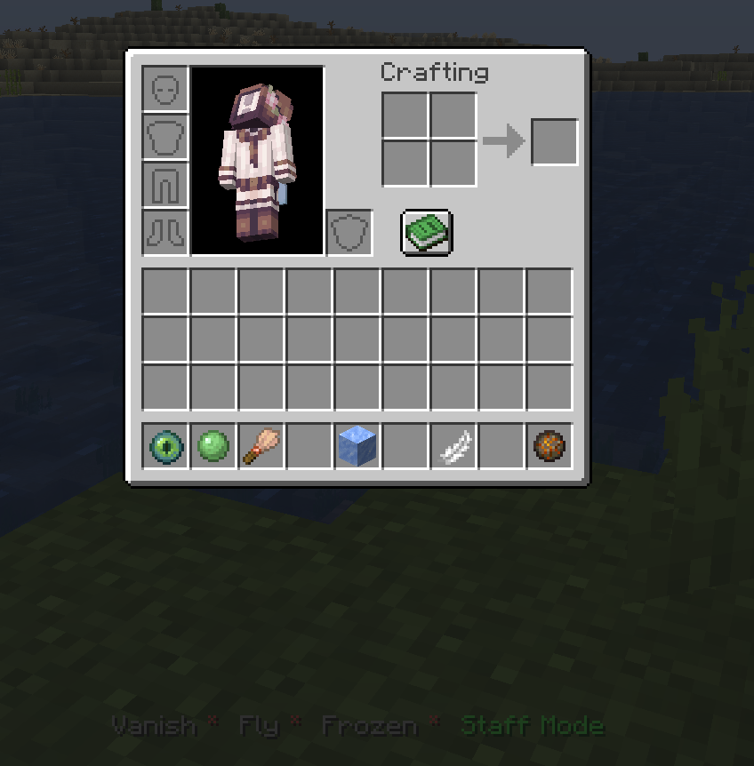
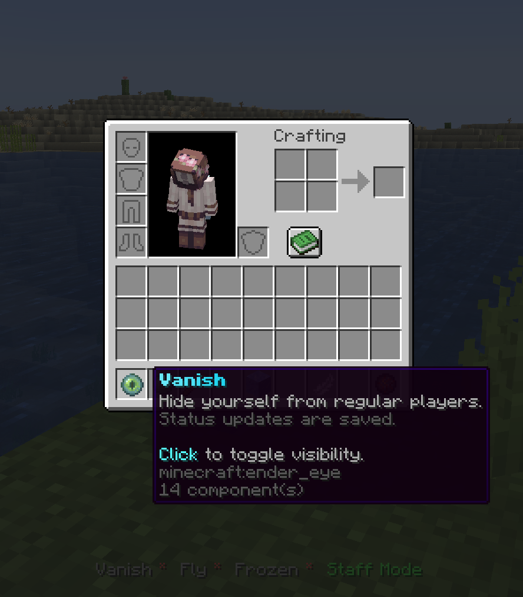
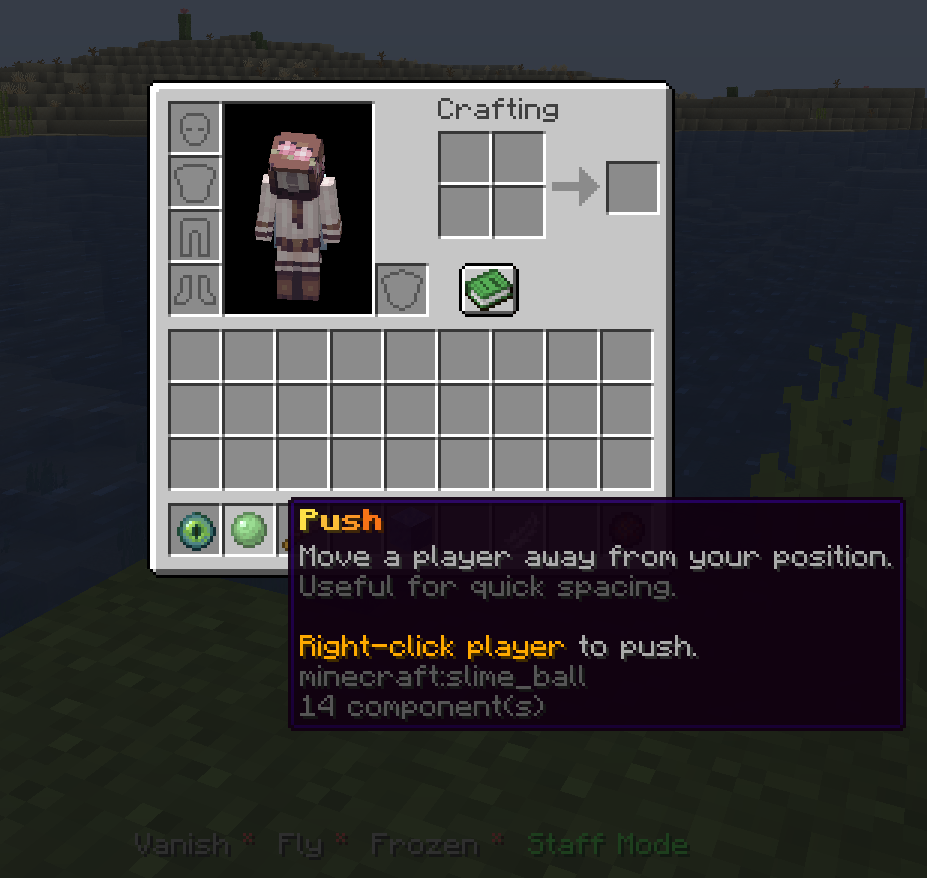
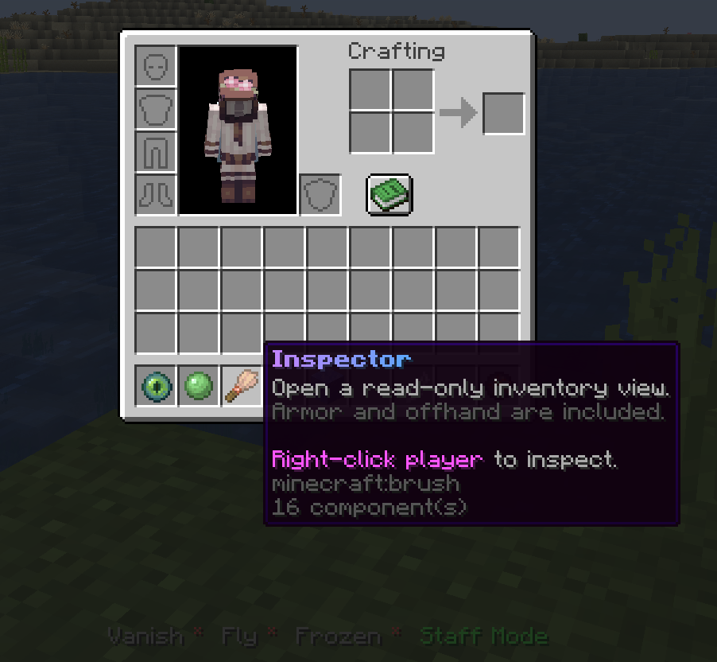
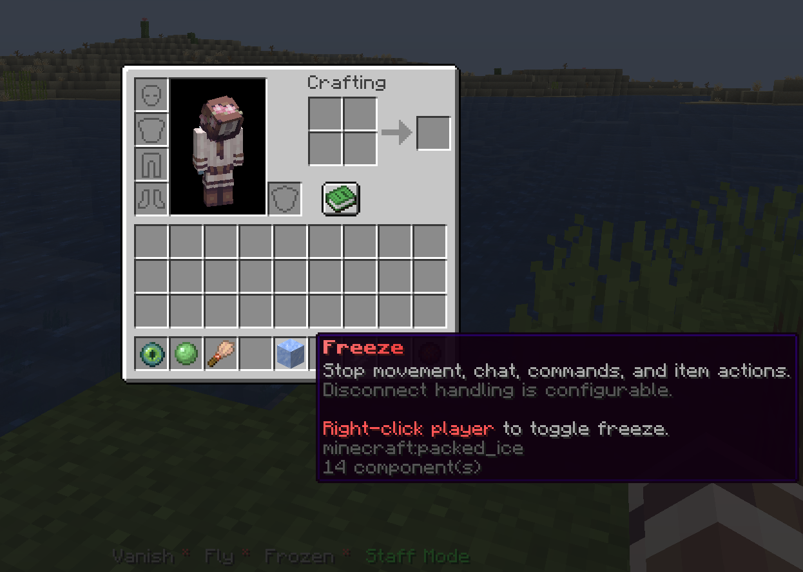
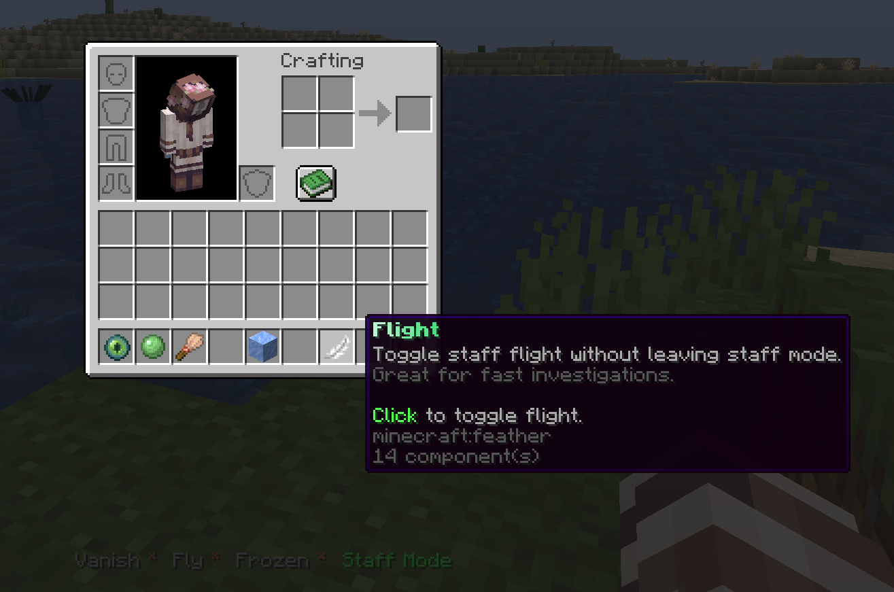
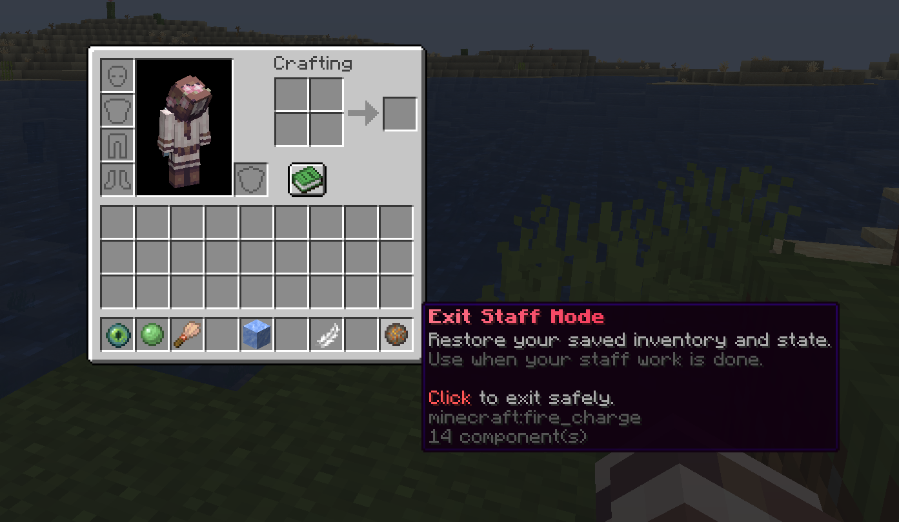

# LightStaff

A modern staff utility plugin for Paper and Folia servers. LightStaff gives moderators a clean staff mode toolset for investigations: hotbar tools, vanish, freeze, inspection, teleporting, recovery, audit logging, and flexible storage.

Built against Paper `1.19.4` with Java 17, while keeping the runtime path ready for newer Paper builds.

## Showcase

### Staff Mode Hotbar

The default setup gives staff a compact investigation hotbar with clear names, lore, and actionbar state.

<p align="center">
  
</p>


### Staff Mode Tools

Staff entering Staff Mode receives a configurable hotbar:

| Slot | Tool | Purpose |
| ---: | --- | --- |
| `0` | Vanish | Hide from regular players while staying visible to staff with permission. |
| `1` | Push | Move players away for quick spacing or control. |
| `2` | Inspector | Open a read-only inventory view with armor and offhand. |
| `4` | Freeze | Stop movement, chat, commands, damage bypasses, and inventory actions. |
| `6` | Flight | Toggle flight while investigating. |
| `8` | Exit | Leave Staff Mode and restore the saved player state. |

Every tool is configured in `tools.yml`: enabled state, slot, permission, material fallback list, cooldown, display name, lore, sound, volume, and pitch.


<table>
  <tr>
    <td width="50%">
      <strong>Vanish</strong><br>
      Hide from regular players while preserving staff visibility rules.<br><br>
      
    </td>
    <td width="50%">
      <strong>Push</strong><br>
      Move a player away from your current position for quick spacing.<br><br>
      
    </td>
  </tr>
  <tr>
    <td width="50%">
      <strong>Inspector</strong><br>
      Open a read-only inventory view with armor and offhand included.<br><br>
      
    </td>
    <td width="50%">
      <strong>Freeze</strong><br>
      Stop movement, chat, commands, and inventory actions during moderation.<br><br>
      
    </td>
  </tr>
  <tr>
    <td width="50%">
      <strong>Flight</strong><br>
      Toggle staff flight without leaving Staff Mode.<br><br>
      
    </td>
    <td width="50%">
      <strong>Exit Staff Mode</strong><br>
      Restore the saved inventory and player state safely.<br><br>
      
    </td>
  </tr>
</table>


### Storage Choices

Pick the backend that fits the server:

- `sqlite` for simple local production use
- `json` for readable local files
- `mysql` for networked setups
- `mariadb` for MariaDB deployments

### Combat-Aware Staff Mode

LightStaff can block players from entering Staff Mode while combat tagged. The check is configurable and supports:

- metadata keys used by combat plugins
- PlaceholderAPI placeholders
- a bypass permission for trusted staff

## Features

- Staff Mode enter/exit with inventory, armor, offhand, exp, gamemode, and flight restoration
- Persistent vanish and freeze state
- Read-only inventory inspection
- Freeze command and freeze tool with disconnect handling
- Staff teleport command
- Staff whitelist bypass mode
- Session recovery command
- Audit logging for moderation actions
- Configurable actionbar
- Configurable command, plugin, and tool messages
- Configurable storage: SQLite, JSON, MySQL, MariaDB
- Paper and Folia scheduler support
- Material fallback lists for cross-version compatibility

## Requirements

- Java 17 or newer
- Paper `1.19.4+`
- Optional: PlaceholderAPI
- Optional: CombatLogX, PvPManager, DeluxeCombat, CombatPlus, or another combat plugin exposed through metadata or PlaceholderAPI

## Installation

1. Download the latest jar from GitHub Releases.
2. Put it in your server `plugins` folder.
3. Start the server once.
4. Edit the generated files in `plugins/LightStaff/`.
5. Run `/lightstaff reload` or restart the server.

## Configuration

LightStaff separates configuration into three files:

| File | Purpose |
| --- | --- |
| `config.yml` | Plugin behavior, storage, combat checks, freeze behavior, whitelist mode, audit logging |
| `tools.yml` | Staff tool setup, slots, permissions, materials, names, lore, sounds |
| `messages.yml` | Prefix, command messages, plugin messages, actionbar labels |

## Storage

Default:

```yaml
storage:
  type: "sqlite"
```

Available values:

```yaml
storage:
  type: "sqlite" # sqlite, json, mysql, mariadb
```

JSON storage writes to:

- `plugins/LightStaff/data/sessions.json`
- `plugins/LightStaff/data/moderation_states.json`

## Combat Blocking

```yaml
combat:
  block_lightstaff_entry: true
  bypass_permission: "lightstaff.combat.bypass"
  metadata_keys:
    - "combatlogx_in_combat"
    - "in_combat"
    - "combatTagged"
  placeholderapi:
    enabled: true
    placeholders:
      - "%combatlogx_in_combat%"
      - "%pvpmanager_in_combat%"
    combat_values:
      - "yes"
      - "true"
      - "1"
      - "tagged"
```

Players with the configured bypass permission can enter Staff Mode even while tagged.

## Freeze Disconnect Message

Single line:

```yaml
freeze_ban_message: "You disconnected while frozen."
```

Multiple lines:

```yaml
freeze_ban_message:
  - "You disconnected while frozen."
  - "Open a ticket if this was a mistake."
```

## Commands

| Command | Description |
| --- | --- |
| `/lightstaff`, `/ls`, `/staffmode`, `/sm` | Toggle Staff Mode |
| `/lightstaff reload` | Reload config, tools, and messages |
| `/lightstaff status [player]` | Show staff/vanish/freeze/session status |
| `/lightstaff recover <player>` | Recover a saved Staff Mode session |
| `/vanish [player]` | Toggle vanish for yourself or another player |
| `/freeze <player> [reason]` | Toggle freeze |
| `/freeze on <player> [reason]` | Freeze a player |
| `/freeze off <player>` | Unfreeze a player |
| `/unfreeze <player>` | Unfreeze a player |
| `/stafftp <player>` | Teleport to an online player |
| `/staffwhitelist` | Toggle staff whitelist bypass mode |

## Permissions

| Permission | Description |
| --- | --- |
| `lightstaff.use` | Use Staff Mode |
| `lightstaff.reload` | Reload configuration |
| `lightstaff.recover` | Recover stuck sessions |
| `lightstaff.status` | View status |
| `lightstaff.vanish` | Use vanish |
| `lightstaff.vanish.others` | Vanish other players |
| `lightstaff.freeze` | Freeze players |
| `lightstaff.freeze.staff` | Freeze staff users |
| `lightstaff.inspect` | Inspect inventories |
| `lightstaff.inspect.staff` | Inspect staff users |
| `lightstaff.fly` | Use flight tool |
| `lightstaff.push` | Use push tool |
| `lightstaff.stafftp` | Use staff teleport |
| `lightstaff.whitelist.toggle` | Toggle staff whitelist mode |
| `lightstaff.whitelist.bypass` | Bypass staff whitelist mode |
| `lightstaff.combat.bypass` | Enter Staff Mode while combat tagged |
| `lightstaff.creative` | Use creative-mode behavior in Staff Mode |
| `lightstaff.see` | See vanished staff |
| `lightstaff.alerts` | Receive staff join/leave alerts |
| `lightstaff.admin` | Admin wildcard handled by LightStaff |
| `lightstaff.*` | Full LightStaff access |

## Building

```bash
mvn -DskipTests clean package
```

The jar is created at:

```text
target/LightStaff-1.0.0.jar
```

## License

LightStaff is licensed under the MIT License. See `LICENSE` for details.
